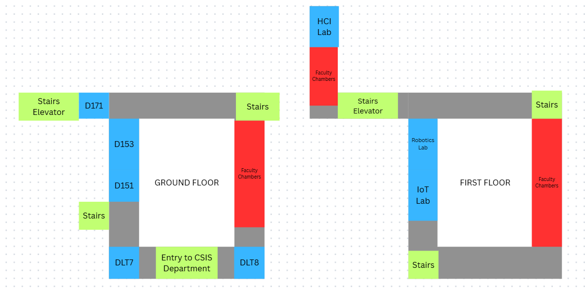

# 📍 Indoor Localization & Activity Recognition on ESP32

An end-to-end IoT system that performs **real-time indoor localization** and **activity recognition** on an ESP32 microcontroller using TensorFlow Lite Micro. The system uses Wi-Fi RSSI fingerprinting to determine the user's room-level location within a university CS department, and an MPU6050 IMU sensor to classify user activity — all running on-device at the edge. Results are streamed over MQTT to a live web dashboard.

---

## 📐 System Architecture

```
┌─────────────────────────────────────────────────────────────────┐
│                        ESP32 (Edge Device)                      │
│                                                                 │
│  ┌──────────────────────┐     ┌──────────────────────────────┐  │
│  │   Wi-Fi Scanner      │     │   MPU6050 IMU Sensor (I2C)   │  │
│  │   (RSSI Fingerprint) │     │   (Accelerometer + Gyroscope)│  │
│  └────────┬─────────────┘     └──────────────┬───────────────┘  │
│           │                                  │                  │
│           ▼                                  ▼                  │
│  ┌──────────────────────┐     ┌──────────────────────────────┐  │
│  │  Localization MLP    │     │   Activity Recognition MLP   │  │
│  │  (TFLite Micro)      │     │   (TFLite Micro)             │  │
│  │  35 RSSI → 11 rooms  │     │   300 features → 3 classes   │  │
│  └────────┬─────────────┘     └──────────────┬───────────────┘  │
│           │                                  │                  │
│           └──────────┬───────────────────────┘                  │
│                      ▼                                          │
│            ┌──────────────────┐                                 │
│            │  MQTT Publisher  │                                 │
│            │  (HiveMQ Cloud)  │                                 │
│            └────────┬─────────┘                                 │
└─────────────────────┼───────────────────────────────────────────┘
                      │  JSON: {"location": "...", "activity": "..."}
                      ▼
             ┌──────────────────┐
             │   Web Dashboard  │
             │  (MQTT over WSS) │
             │  Live Floor Map  │
             └──────────────────┘
```

---

## 🛠️ Hardware Setup

<p align="center">
  
</p>

### Components

| Component | Description |
|-----------|-------------|
| **ESP32 Dev Board** (HW-463) | Main microcontroller with built-in Wi-Fi |
| **MPU6050** | 6-axis IMU (3-axis accelerometer + 3-axis gyroscope) connected over I2C |
| **Breadboard** | For prototyping connections |
| **Jumper Wires** | I2C connections (SDA, SCL, VCC, GND) between ESP32 and MPU6050 |
| **USB Cable** | Power supply + serial communication with PC |

### Wiring (ESP32 ↔ MPU6050)

| MPU6050 Pin | ESP32 Pin |
|-------------|-----------|
| VCC | 3.3V |
| GND | GND |
| SDA | GPIO 21 (default I2C SDA) |
| SCL | GPIO 22 (default I2C SCL) |

---

## 📂 Project Structure

```
├── Arduino_Codes/
│   ├── Wifi_Scan_CS_Dept/          # Wi-Fi RSSI data collection sketch
│   ├── imu_data_logger/            # MPU6050 IMU data collection sketch
│   ├── localization_tflite/        # On-device inference (localization + activity)
│   ├── localization_tflite_with_mqtt/  # Inference + MQTT publishing to dashboard
│   └── mqtt_basic_hiveMQ/          # Basic MQTT connectivity test
│
├── Localization/
│   ├── Python Files/               # Data processing & model training scripts
│   ├── Data Files/                 # Processed CSV datasets
│   └── MLP Files/                  # Trained models & metadata
│
├── Activity_Detection/
│   ├── *.py                        # IMU data processing & model training scripts
│   ├── Activity_Detection_Data/    # Raw per-activity CSV files
│   ├── IMU_data/ & IMU_data2/      # Raw IMU sensor recordings
│   └── *.tflite, *.h5, *.npy      # Trained models & processed data
│
├── Web_App/
│   ├── index.html                  # Real-time dashboard (MQTT + floor plan)
│   └── floor.png                   # CS department floor plan
│
├── fingerprinting_data_2/          # Raw Wi-Fi RSSI data per location (11 CSVs)
├── Project Setup.jpg               # Hardware setup photo
└── README.md                       # This file
```

---

## 🎯 Features

### ✅ Indoor Localization (Successfully Implemented)
- **Technique**: Wi-Fi RSSI fingerprinting using the `BPGC-NAB` campus network
- **Model**: 2-layer MLP (64 → 32 hidden units) with dropout, fully INT8-quantized
- **Input**: RSSI values from 35 Wi-Fi access points (filtered from 43 total)
- **Output**: Classification into **11 rooms** across ground and first floors:
  - `d171`, `d151d153`, `dlt7`, `dlt8` (classrooms)
  - `iotLab2`, `roboticsLab`, `systemsLab2` (labs)
  - `bijuOffice`, `csHod`, `meetingRoom`, `itRoom` (offices/rooms)
- **Inference**: Runs on-device on ESP32 using TensorFlow Lite Micro

### ⚠️ Activity Detection (Not Successfully Implemented)
- **Goal**: Classify user activity (stationary, walking, stairs) from MPU6050 IMU data
- **Approach**: Windowed time-series classification using an MLP on accelerometer data
- **Status**: The model was trained and deployed alongside the localization model on the ESP32, but **activity detection was not successfully implemented** in practice. The activity recognition accuracy was insufficient for reliable real-world use, likely due to limited training data variety and the simplicity of the MLP architecture for time-series IMU data.

### ✅ Live Web Dashboard
- Real-time location visualization on an interactive floor plan
- MQTT-based communication over secure WebSockets
- Message logging with CSV export capability

---

## 🔧 How to Replicate

### Prerequisites

- **Hardware**: ESP32 dev board + MPU6050 IMU sensor (see [Hardware Setup](#-hardware-setup))
- **Software**:
  - [Arduino IDE](https://www.arduino.cc/ide) with ESP32 board support
  - Python 3.8+ with the following packages:
    ```
    pip install numpy pandas scikit-learn tensorflow pyserial matplotlib seaborn
    ```
- **Arduino Libraries** (install via Library Manager):
  - `Adafruit MPU6050`
  - `Adafruit Unified Sensor`
  - `PubSubClient` (for MQTT)
  - `ArduinoJson`
  - `WiFiClientSecure` (built into ESP32 core)

---

### Step 1: Collect Wi-Fi Fingerprint Data

1. Flash the **`Wifi_Scan_CS_Dept`** Arduino sketch onto the ESP32.
2. For each location you want to map:
   - Edit the `location` variable in the sketch to the current room name (e.g., `"iotLab2"`).
   - Flash the updated sketch and walk to that location.
   - Run the Python logger on your PC to capture serial data:
     ```bash
     cd Localization/Python\ Files/
     python wifi_signal_logging.py
     ```
   - Collect data for 2–5 minutes per location. This captures RSSI values from nearby `BPGC-NAB` access points.
   - Save each location's CSV to the `fingerprinting_data_2/` directory.

### Step 2: Process Wi-Fi Data into a Training Dataset

Run the following scripts **in order** from the `Localization/Python Files/` directory:

```bash
# 1. Merge all per-location CSVs into one file
python merged_csv.py
# Output: merged_raw.csv

# 2. (Optional) View summary statistics of RSSI data
python summary_statistics.py
# Output: fingerprint_summary.csv

# 3. Create the fingerprint pass matrix (5-second median windows)
python pivot_pass_matrix.py
# Output: fingerprint_pass_matrix.csv

# 4. Remove rarely-seen access points (keeps APs in ≥3% of scans)
python remove_rare_aps.py
# Output: fingerprint_pass_matrix_cleaned.csv, kept_aps.txt

# 5. Fix headers and prepare for model training
python restructure_fingerprint_pass_matrix.py
# Output: fingerprint_pass_matrix_fixed.csv
```

### Step 3: Train the Localization Model

```bash
cd Localization/MLP\ Files/
python ../Python\ Files/train_mlp_localization.py
```

This trains a Keras MLP, evaluates accuracy on a held-out test set, and exports:
- `mlp_keras.h5` — full Keras model
- `mlp_model.tflite` — INT8-quantized TFLite model for ESP32
- `mlp_features.txt` — ordered list of 35 AP MAC addresses (feature order)
- `mlp_label_map.txt` — mapping of output indices to room names
- `mlp_meta.json` — model metadata (input dim, hidden units, RSSI range)

### Step 4: Convert the Model for Arduino

```bash
cd Localization/MLP\ Files/
python generate_cc_array.py
```

This converts `mlp_model.tflite` into `mlp_model.cc` — a C byte array that can be `#include`d directly in the Arduino sketch.

### Step 5: Collect IMU Data (Activity Detection)

1. Flash the **`imu_data_logger`** sketch onto the ESP32.
2. Attach the MPU6050 sensor to the user (e.g., in a pocket or on the wrist).
3. Run the IMU logger:
   ```bash
   cd Activity_Detection/
   python imu_logger_mpu6050.py
   ```
4. When prompted, enter the activity label (e.g., `walking`, `stationary`, `stairs`).
5. Perform the activity for ~75 seconds (3750 samples at 50 Hz).
6. Repeat for each activity, collecting multiple sessions.

### Step 6: Process IMU Data and Train the Activity Model

```bash
cd Activity_Detection/

# 1. Merge per-activity CSVs
python merge_csv.py

# 2. Clean the data (remove initial noisy samples)
python merged_clean.py

# 3. (Optional) Remove gyroscope data to use accelerometer only
python remove_gyro.py

# 4. Create sliding windows (50 samples, stride 25)
python windowing_samples.py

# 5. Train the MLP model
python activity_model_train.py

# 6. Convert to INT8 TFLite
python activity_tfLite_model.py

# 7. Generate C header with scaler parameters for ESP32
python scaler_for_esp32.py
```

### Step 7: Deploy to ESP32

1. Copy the generated model files into the Arduino sketch directory:
   - `mlp_model.cc` / `mlp_model.h` → `Arduino_Codes/localization_tflite_with_mqtt/`
   - `activity_mlp.cc` / `activity_mlp.h` → same directory
   - `activity_scaler.h` → same directory
   - `mlp_features.h` → same directory (update MAC addresses and labels if needed)

2. Edit the Wi-Fi and MQTT credentials in the sketch:
   ```cpp
   const char* ssid = "YOUR_WIFI_SSID";
   const char* password = "YOUR_WIFI_PASSWORD";
   const char* mqtt_username = "YOUR_MQTT_USER";
   const char* mqtt_password = "YOUR_MQTT_PASS";
   ```

3. Flash **`localization_tflite_with_mqtt`** to the ESP32 via Arduino IDE.

4. Open the Serial Monitor (115200 baud) to verify predictions are being made and published.

### Step 8: Launch the Web Dashboard

1. Open `Web_App/index.html` in a web browser.
2. The dashboard will automatically connect to the HiveMQ Cloud MQTT broker via WebSockets.
3. As the ESP32 publishes predictions, the dashboard will:
   - Show the current predicted location as text.
   - Move a yellow marker on the floor plan to the corresponding room.
   - Display the predicted activity (if available).
   - Log all received messages with timestamps.
4. Use the **"Download Log as CSV"** button to export the message history.

---

## 🧠 Model Details

### Localization MLP

| Parameter | Value |
|-----------|-------|
| Input Features | 35 (Wi-Fi AP RSSI values) |
| Hidden Layers | Dense(64, ReLU) → Dense(32, ReLU) |
| Dropout | 0.2 |
| Output | 11 classes (Softmax) |
| RSSI Normalization | Scaled to [-1, 1] from range [-110, -30] dBm |
| Missing AP Fill Value | -105 dBm |
| Quantization | Full INT8 (input, weights, output) |
| Model Size (TFLite) | ~7.5 KB |
| TFLite Arena | 32 KB |

### Activity MLP

| Parameter | Value |
|-----------|-------|
| Input Features | 50 (sliding window of accelerometer Z-axis) |
| Hidden Layers | Dense(64, ReLU) → Dropout(0.2) → Dense(64, ReLU) |
| Output | 3 classes (stationary, walking, stairs) |
| Sampling Rate | 50 Hz |
| Window Size | 50 samples (1 second) |
| Window Stride | 25 samples (50% overlap) |
| Quantization | Full INT8 |
| Model Size (TFLite) | ~10.5 KB |
| TFLite Arena | 12 KB |

---

## 🌐 Communication

- **Protocol**: MQTT over TLS (port 8883 for ESP32, port 8884/WSS for web)
- **Broker**: [HiveMQ Cloud](https://www.hivemq.com/mqtt-cloud-broker/)
- **Topic**: `esp32/localization`
- **Payload Format**:
  ```json
  {
    "location": "roboticsLab",
    "activity": "Walking"
  }
  ```
- **Publish Interval**: Every 5 seconds

---

## 🗺️ Mapped Locations

The system covers **11 rooms** across two floors of the CSIS (CS & IS) Department:

**Ground Floor**: D171, D151/D153, DLT7, DLT8, Meeting Room

**First Floor**: IoT Lab, Robotics Lab, Systems Lab 2, CS HoD Office, IT Room, Biju Sir's Office

<p align="center">
  
</p>

---

## 📊 Data Pipeline Summary

```
                    LOCALIZATION                                    ACTIVITY DETECTION
                    ────────────                                    ──────────────────

ESP32 Wi-Fi Scan ──► Serial ──► wifi_signal_logging.py    ESP32+MPU6050 ──► Serial ──► imu_logger_mpu6050.py
                                       │                                                       │
                                       ▼                                                       ▼
                              Per-location CSVs                                    Per-activity CSVs
                                       │                                                       │
                                       ▼                                                       ▼
                              merged_csv.py                                        merge_csv.py
                                       │                                                       │
                                       ▼                                                       ▼
                              merged_raw.csv                                       merged_raw.csv
                                       │                                                       │
                                       ▼                                                       ▼
                           pivot_pass_matrix.py                                  merged_clean.py
                                       │                                                       │
                                       ▼                                                       ▼
                        fingerprint_pass_matrix.csv                              merged_clean.csv
                                       │                                                       │
                                       ▼                                                       ▼
                           remove_rare_aps.py                                windowing_samples.py
                                       │                                                       │
                                       ▼                                                       ▼
                   fingerprint_pass_matrix_cleaned.csv                    X_windows.npy + y_windows.npy
                                       │                                                       │
                                       ▼                                                       ▼
                restructure_fingerprint_pass_matrix.py                   activity_model_train.py
                                       │                                                       │
                                       ▼                                                       ▼
                   fingerprint_pass_matrix_fixed.csv                       activity_mlp.h5
                                       │                                                       │
                                       ▼                                                       ▼
                      train_mlp_localization.py                           activity_tfLite_model.py
                                       │                                                       │
                                       ▼                                                       ▼
                          mlp_model.tflite                                activity_mlp.tflite
                                       │                                                       │
                                       ▼                                                       ▼
                        generate_cc_array.py                              scaler_for_esp32.py
                                       │                                                       │
                                       ▼                                                       ▼
                           mlp_model.cc                          activity_mlp.cc + activity_scaler.h
                                       │                                                       │
                                       └──────────────────┬────────────────────────────────────┘
                                                          ▼
                                              Arduino Sketch (ESP32)
                                                          │
                                                          ▼
                                                 MQTT → Web Dashboard
```

---

## ⚙️ Technologies Used

| Category | Technology |
|----------|------------|
| Microcontroller | ESP32 (HW-463) |
| IMU Sensor | MPU6050 (6-axis) |
| ML Framework | TensorFlow / Keras (training), TensorFlow Lite Micro (inference) |
| Quantization | Full INT8 (for microcontroller deployment) |
| Communication | MQTT over TLS (HiveMQ Cloud) |
| Web Frontend | Vanilla HTML / CSS / JavaScript |
| MQTT Client (Web) | [MQTT.js](https://github.com/mqttjs/MQTT.js) via CDN |
| Data Processing | Python (pandas, NumPy, scikit-learn) |
| Visualization | matplotlib, seaborn |
| IDE | Arduino IDE |

---

## 📝 Notes

- The Wi-Fi scanning targets the **`BPGC-NAB`** SSID (Birla Goa campus Wi-Fi). To adapt this for a different environment, you would need to change the target SSID and recollect fingerprint data for your locations.
- The MQTT credentials in the repository are for a test HiveMQ Cloud instance. Replace them with your own for a production setup.
- The `localization_tflite` sketch runs both models **without** network connectivity (Serial output only), while `localization_tflite_with_mqtt` adds Wi-Fi and MQTT for the web dashboard.
- The `mqtt_basic_hiveMQ` sketch is a standalone connectivity test — useful for debugging MQTT issues before full deployment.

---

## 📄 License

This project was developed as part of the **Internet of Things** course at **BITS Pilani, Goa Campus** (Semester 1).